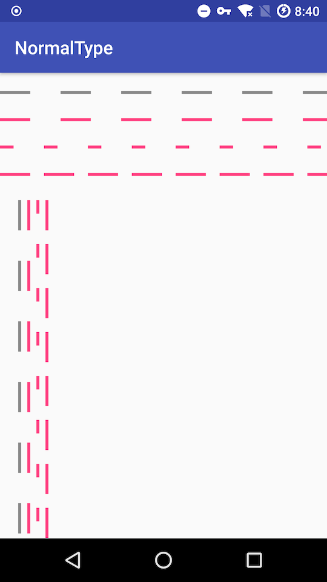

## XDashView

DashView for android. XDashView has many implemets of Dash Line.

## Definition of terms

| Name       | Definition                               |
| :--------- | ---------------------------------------- |
| cell       | Cell is the base item of the whole dash line. |
| dash       | Dash is the spacing between of cells.    |
| cellWidth  | The Width of a cell. Width is always has same ORIENTATION of the dash line. |
| cellHeight | The Height of a cell.                    |
| dashWidth  | The Width of a dash. Width is always has same ORIENTATION of the dash line. |
| dashHeight | The Height of a dash.                    |

## Dash Type

This library will support multiple dash style. Type like :

- [x] Normal Type : The very normal type
- [ ] Shaped Type : DashView cel can has some specific shape, such like circle，oval etc.
- [ ] Drawable Type : DashView cell can be applied to some Drawable object.

## Screenshots

## TODO

- [ ] publish this lib to jcenter.
- [ ] add Shaped Type implements.
- [ ] add Drawable Type implements.